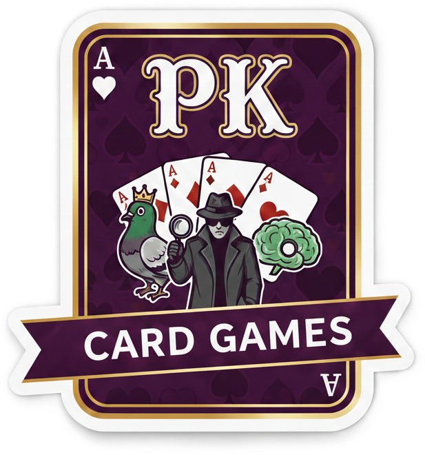

# PK Travel Games

[🇫🇷 FR](README.md) · [🇬🇧 EN](README_en.md)

✨ Mini‑suite de jeux sociaux pour voyages et soirées. PWA installable, 100% vanilla JS, offline.

## ✅ Fonctionnalités

- 🐦 **Le Pigeon** : culture & bluff (mensonges crédibles à inventer).
- 📱 **Le Frontal** : deviner par inclinaison du téléphone (accéléromètre).
- 🕵️ **L'Espion** : déduction sociale avec rôles cachés.
- 📲 **PWA** : installable sur mobile, fonctionne hors‑ligne.

## 🧠 Utilisation

**Le Pigeon**
1. Un joueur reçoit une question + sa vraie réponse.
2. Il invente deux fausses réponses crédibles.
3. Les autres devinent la vraie parmi les trois.

**Le Frontal**
1. Placez le téléphone sur le front.
2. Inclinez **haut** = bonne réponse.
3. Inclinez **bas** = passer.
4. Objectif : max de points en 60 secondes.

**L'Espion**
- **Civils** : mot A.
- **Undercovers** : mot B (proche).
- **Mr. White** : aucun mot.
- Décrivez, votez, éliminez l’intrus.

## 🧾 Changelog

- **1.1.0** : Refonte vanilla JS (suppression Vite/node_modules), nouvelle architecture web/, fix OVH (PHP proxy pour .db)
- **1.0.0** : Release initiale - 3 jeux, PWA, vanilla JS

## 🔗 Liens

- EN README : README_en.md
